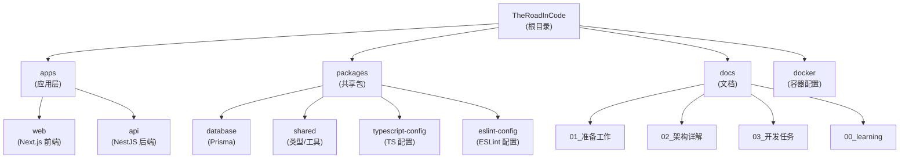

# TheRoadInCode - AI 协作上下文文档

> 现代化个人博客系统 - 技术分享、作品展示、学习实验平台
>
> **最后更新**: 2026-01-21 | **版本**: 0.0.1 | **状态**: M1 开发中

---

## 变更记录 (Changelog)

### 2026-01-21

- 初始化 AI 上下文文档
- 完成项目架构扫描
- 生成模块索引和导航结构

---

## 项目愿景

TheRoadInCode 是一个三位一体的现代化个人技术平台：

1. **技术分享** - 深度技术文章、系列教程、代码片段库
2. **作品展示** - 项目作品集、开源贡献、技术栈展示
3. **学习实验** - 技术实验记录、性能对比分析、学习笔记体系

### 核心设计理念

- **统一内容基座 Entry** - 所有内容类型（Post/Work/Experiment/Note）共享基础架构
- **版本管理机制** - EntryRevision 支持草稿保存、历史回溯
- **类型安全优先** - 前后端共享 TypeScript 类型定义
- **渐进式增强** - 从 MVP 到完整功能的平滑演进

---

## 架构总览

### 技术栈

**前端 (apps/web)**

- Next.js 15.1+ (App Router + Turbopack)
- React 19 + TypeScript 5.3+
- TailwindCSS 3.4 + Shadcn/ui
- TanStack Query + Zustand (状态管理)
- Geist Font (字体系统)

**后端 (apps/api)**

- NestJS 10.4+ (Express 平台)
- Prisma 5.22+ ORM
- PostgreSQL 数据库
- JWT 认证 + 速率限制
- 全局异常过滤 + 响应转换

**基础设施**

- Monorepo: Turborepo 2.3+ + pnpm 9.15+
- 代码质量: ESLint 9.x Flat Config + Prettier + Husky
- 容器化: Docker Compose (PostgreSQL)
- CI/CD: GitHub Actions

### 数据模型概览

**当前实现** (基础 Schema):

- User, OAuthAccount - 用户认证
- Post, Category, Tag, PostTag - 技术分享
- Comment - 评论系统
- Work - 作品展示

**规划中** (完整 Entry 基座):

- Entry, EntryRevision - 统一内容基座 + 版本管理
- EntryMeta, EntryTag, EntryCategory - 元数据关联
- Post, Work, Experiment, Note - 内容扩展表
- Series, Snippet, Comparison - 高级功能
- OutboxEvent - 事件溯源

---

## 模块结构图



---

## 模块索引

| 模块路径                     | 类型   | 职责                           | 状态   | 关键技术                          |
| ---------------------------- | ------ | ------------------------------ | ------ | --------------------------------- |
| `apps/web`                   | 应用   | Next.js 前端 - 用户界面与交互  | 开发中 | Next.js 15, React 19, TailwindCSS |
| `apps/api`                   | 应用   | NestJS 后端 - RESTful API 服务 | 开发中 | NestJS 10, Prisma, JWT            |
| `packages/database`          | 工具包 | Prisma Schema + Client 封装    | 开发中 | Prisma 5.22, PostgreSQL           |
| `packages/shared`            | 工具包 | 前后端共享类型、常量、工具函数 | 开发中 | TypeScript                        |
| `packages/typescript-config` | 配置   | 统一 TypeScript 配置           | 稳定   | TypeScript 5.3                    |
| `packages/eslint-config`     | 配置   | ESLint 9.x Flat Config 规则    | 稳定   | ESLint 9.14                       |

---

## 运行与开发

### 环境要求

```bash
Node.js >= 20.0.0
pnpm >= 9.0.0
Docker (可选，用于本地 PostgreSQL)
```

### 快速启动

```bash
# 1. 安装依赖
pnpm install

# 2. 启动数据库 (Docker)
cd docker && docker-compose up -d

# 3. 配置环境变量
cp apps/api/.env.example apps/api/.env.local
cp apps/web/.env.example apps/web/.env.local

# 4. 初始化数据库
cd packages/database
pnpm db:push
pnpm db:studio  # 可选：打开 Prisma Studio

# 5. 启动全部应用
cd ../..
pnpm dev
```

访问地址：

- 前端: http://localhost:3000
- 后端: http://localhost:4000
- Prisma Studio: http://localhost:5555

### 开发命令

```bash
# 开发模式（前后端同时启动）
pnpm dev

# 构建所有应用
pnpm build

# 代码检查与格式化
pnpm lint
pnpm format

# 测试
pnpm test

# 清理构建产物
pnpm clean

# 数据库操作（在 packages/database 目录）
pnpm db:generate    # 生成 Prisma Client
pnpm db:push        # 推送 Schema 到数据库
pnpm db:migrate     # 创建 migration
pnpm db:studio      # 打开 Prisma Studio
```

---

## 测试策略

### 当前状态

- 单元测试: Jest 配置已就绪（后端）
- E2E 测试: 待实现
- 集成测试: 待实现

### 测试覆盖计划

1. **M1 阶段**: 手动测试 + Postman API 测试
2. **M2+ 阶段**: 逐步添加自动化测试
   - 后端: Service 层单元测试
   - 前端: 组件测试 (Testing Library)
   - E2E: Playwright (生产部署后)

---

## 编码规范

### TypeScript 规范

- 严格模式启用 (`strict: true`)
- 避免使用 `any`，优先使用 `unknown` 或具体类型
- 使用 `interface` 定义对象结构，`type` 用于联合/交叉类型
- 前后端共享类型定义放在 `@repo/shared`

### 命名规范

- 文件名: kebab-case (`user-service.ts`)
- 组件名: PascalCase (`UserProfile.tsx`)
- 变量/函数: camelCase (`getUserById`)
- 常量: UPPER_SNAKE_CASE (`API_BASE_URL`)
- 类型/接口: PascalCase (`UserDto`, `IUserService`)

### ESLint 规则重点

- Import 排序：内置 > 外部 > 内部 > 父级 > 同级
- 未使用变量警告（下划线前缀忽略：`_unused`）
- Prettier 集成（格式化自动修复）

### Git 工作流

- 分支命名: `feat/xxx`, `fix/xxx`, `docs/xxx`
- Commit 规范: Conventional Commits
  - `feat:` 新功能
  - `fix:` Bug 修复
  - `docs:` 文档更新
  - `refactor:` 重构
  - `test:` 测试相关
  - `chore:` 构建/工具配置
- Pre-commit Hook: lint-staged + Husky

---

## AI 使用指引

### 与 Claude 协作

**推荐工作流**:

1. **需求讨论** - 描述要实现的功能，获取架构建议
2. **代码实现** - 由你编写代码，Claude 提供指导和代码审查
3. **问题解决** - 遇到 Bug 时提供错误信息，获取调试思路
4. **重构优化** - 代码可工作后，请求优化建议

**Claude 擅长**:

- 架构设计与技术选型建议
- TypeScript 类型定义审查
- 性能优化与最佳实践
- 复杂业务逻辑梳理
- 文档生成与维护

**Claude 不建议用于**:

- 直接生成大段业务代码（容易忽略上下文）
- 替代调试工具（应优先使用 DevTools/断点）
- 配置文件的盲目修改（可能破坏依赖关系）

### 提问技巧

**好的提问**:

```
我想实现 Entry 的版本回滚功能，涉及：
1. 回滚到指定 revisionId
2. 更新 Entry.currentRevisionId
3. 保持已发布状态不变

请问：
- Service 方法的参数设计建议？
- 需要校验哪些边界条件？
- 是否需要记录回滚操作日志？
```

**待改进的提问**:

```
帮我写一个回滚功能
```

### 多 AI 协作

如需咨询其他 AI 助手（Codex/Gemini），请明确指出：

```
@codex 请分析 Prisma Schema 中的索引优化策略
```

---

## 重要文档索引

### 项目规划

- [需求分析](./docs/01_准备工作/01_requirements.md) - 完整功能需求
- [技术架构](./docs/01_准备工作/02_architecture.md) - 架构设计文档
- [项目路线图](./docs/01_准备工作/roadmap.md) - 开发计划

### 架构详解

- [项目结构说明](./docs/02_架构详解/10_项目结构说明.md)
- [Prisma 数据库](./docs/02_架构详解/06_Prisma数据库.md)
- [Next.js 框架](./docs/02_架构详解/04_NextJS框架.md)
- [NestJS 框架](./docs/02_架构详解/05_NestJS框架.md)

### 开发任务

- [开发任务总览](./docs/03_开发任务/README.md)
- [M1: 项目初始化与Entry基座](./docs/03_开发任务/M1-项目初始化与Entry基座.md) - 当前任务

### 学习资源

- [学习指南](./docs/00_learning/README.md)
- [技术栈 Prompts](./docs/00_learning/prompts/master-prompt.md)

---

## 故障排查

### 常见问题

**Q: Turborepo 缓存导致改动不生效**

```bash
# 清除缓存并重新构建
pnpm clean && pnpm build
```

**Q: Prisma Client 类型不更新**

```bash
# 重新生成 Prisma Client
cd packages/database
pnpm db:generate
```

**Q: 前端 API 调用 CORS 错误**

```typescript
// apps/api/src/main.ts 中添加
app.enableCors({
  origin: 'http://localhost:3000',
  credentials: true,
});
```

**Q: pnpm 依赖安装失败**

```bash
# 清除 pnpm 缓存
pnpm store prune
rm -rf node_modules
pnpm install
```

---

## 下一步计划

### M1 当前进度（预计 Week 1-2）

- [x] Monorepo 基础架构搭建
- [x] 基础 Prisma Schema（简化版）
- [x] 后端全局拦截器/过滤器
- [x] 前端布局与状态管理框架
- [ ] **进行中**: Entry 基座 CRUD 实现
- [ ] **进行中**: 版本管理 EntryRevision
- [ ] 简化版认证系统
- [ ] 前端列表/详情页

### M2 规划（Week 3-4）

- MDX 内容渲染与编译
- 代码片段库（Snippet）
- 系列文章（Series）
- 标签与分类管理
- 代码高亮与复制功能

---

## 团队与贡献

- **开发者**: TDY0903
- **AI 助手**: Claude (Anthropic), Codex (OpenAI), Gemini (Google)
- **许可协议**: MIT

### 贡献指南

本项目目前为个人学习项目，暂不接受外部贡献。欢迎 Fork 用于学习参考。

---

**最后提醒**: 本文档由 AI 架构师自动生成，随项目演进持续更新。如发现文档与代码不一致，请优先以代码为准，并提醒 AI 更新文档。
